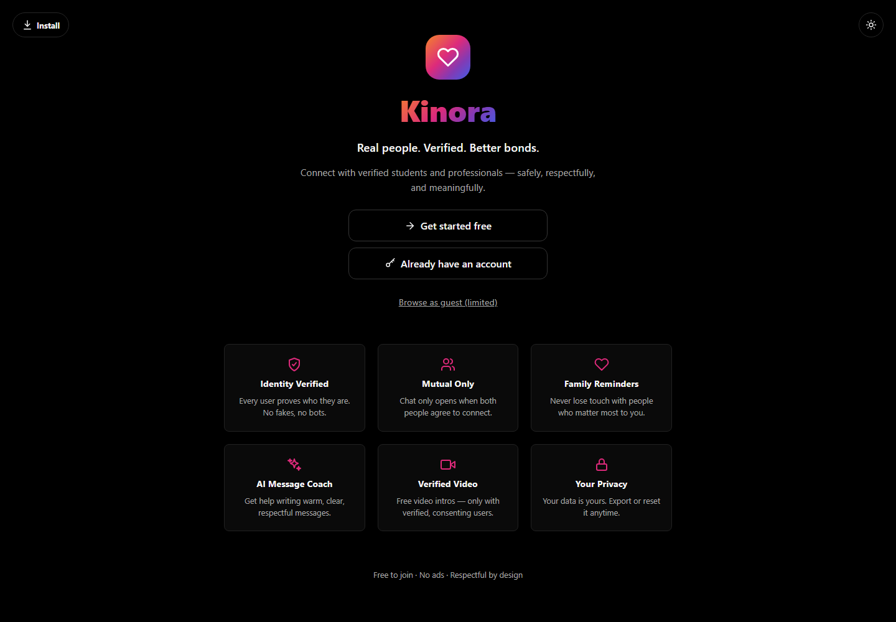
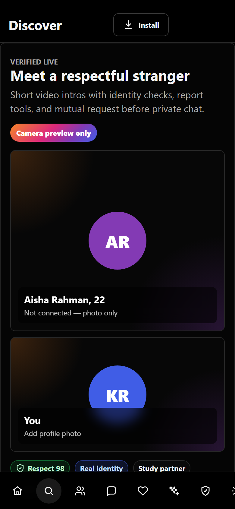
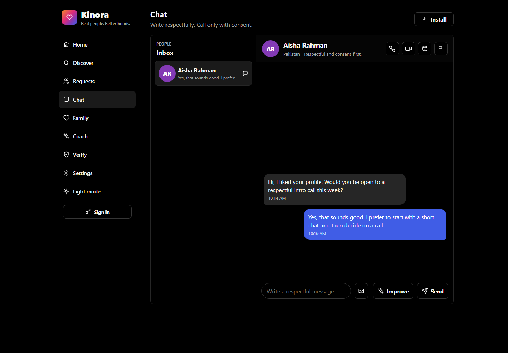

# Kinora Verified

[](https://github.com/abubakarshahid16/Kindred/actions/workflows/deploy-pages.yml)

Kinora is a trust-first social relationship app for verified students, professionals, families, friendships, and serious connections. It combines profile verification, mutual-only chat, private attachments, family reminders, respectful message coaching, and browser-native voice/video calls in an installable PWA.


## Live Links

- Installable GitHub Pages PWA: https://abubakarshahid16.github.io/Kindred/
- Source repository: https://github.com/abubakarshahid16/Kindred

GitHub Pages is the public deployment path for Kinora. The repository workflow builds the installable PWA and publishes it to the `gh-pages` branch after `main` changes are merged.

## Screenshots

| Landing | Discovery |
|---|---|
|  |  |

| Chat and safety | Short demo |
|---|---|
|  |  |

## What Kinora Ships

- Supabase email/password auth with profile sync.
- Verified-user discovery with gender, role, identity, and one-account trust signals.
- Mutual connection requests before chat opens.
- Private chat, attachment uploads, signed file URLs, and respectful-language checks.
- Browser-native voice and video calls with Supabase Realtime signaling.
- Optional TURN credential fetching through a Supabase Edge Function.
- Background Web Push for messages and incoming calls.
- 24-hour stories backed by profile storage.
- Family and friend reconnection reminders.
- Proof upload and verification queue for student/professional review.
- Safety reporting with admin-only approval/suspension paths.
- Local data export/reset controls.
- Installable PWA manifest, service worker, icon, shortcuts, and in-app install button.
- GitHub Pages static build for the public release.

## Architecture

Kinora is intentionally simple to run and review:

- `index.html` loads runtime config, the bundled Supabase client, `config.js`, and `app.js`.
- `config.js` is the single source of truth for the Kinora brand, runtime config keys, browser storage keys, and production-compatible Supabase bucket identifiers.
- `app.js` renders the full client app and talks directly to Supabase on static hosting.
- `build-github-pages.mjs` produces `dist/github-pages`, an installable static PWA.
- `build.mjs` produces an optional worker package in `dist/server/index.js`; GitHub Pages is the public release path.
- `supabase-schema.sql`, `RUN-THIS-IN-SUPABASE.sql`, and `supabase/migrations/*` define the database, RLS, storage policies, and production migration path.
- `supabase/functions/coach` and `supabase/functions/push-send` hold server-side AI/TURN and push-notification logic.

See [docs/ARCHITECTURE.md](docs/ARCHITECTURE.md) for the detailed system map.

## Compatibility Notes

Kinora preserves production data identifiers that would break existing users if renamed blindly:

- Supabase Storage buckets remain `bondbridge-avatars`, `bondbridge-proofs`, and `bondbridge-chat`.
- Legacy browser app state keys are migrated into `kinora-verified-live-v1`.
- Legacy Supabase auth storage is copied from `bondbridge-auth` into `kinora-auth`.
- Legacy runtime globals such as `BONDBRIDGE_SUPABASE_URL` remain supported as fallbacks.
- Realtime channel names keep their existing `bondbridge-*` values so mixed deployed clients can still communicate during rollout.

Apply [supabase/migrations/202608210001_kinora_security_compatibility.sql](supabase/migrations/202608210001_kinora_security_compatibility.sql) after review to rebrand storage policy labels, revoke public execution from trigger-only functions, and add advisor-recommended indexes.

## Local Development

```bash
npm run check
npm run build
npm run build:github-pages
```

For local visual testing, build the GitHub Pages output and serve `dist/github-pages` with any static file server.

## Environment

The browser build reads Kinora-prefixed globals first and legacy globals second:

- `KINORA_SUPABASE_URL`
- `KINORA_SUPABASE_KEY`
- `KINORA_AI_URL`
- `KINORA_TURN_URL`
- `KINORA_VAPID_PUBLIC_KEY`

No paid APIs are required for the core launch stack. Groq and TURN provider secrets are optional Edge Function enhancements.

## Production Checklist

1. Review and merge the Kinora branch.
2. Run the Supabase migration file in production or through your normal migration flow.
3. Confirm Supabase advisors no longer report public executable trigger functions or missing foreign-key indexes.
4. Deploy GitHub Pages from `main`.
5. Confirm the GitHub Pages URL and install flow from a clean browser profile.
6. Test signup, verification, discovery, connection request, chat, attachment upload, push subscription, and voice/video calling with two real devices.

See [PRODUCTION.md](PRODUCTION.md) for deployment details and [docs/MIGRATION.md](docs/MIGRATION.md) for rebrand rollout notes.

## Project Workflow

Kinora uses a review-first GitHub workflow. `main` is the release branch; product work belongs on short-lived `feature/`, `fix/`, or `chore/` branches and lands through a pull request. The repository includes automated checks, code ownership, issue forms, a pull request checklist, and milestone guidance in [docs/GITHUB_WORKFLOW.md](docs/GITHUB_WORKFLOW.md).

The delivery milestones are `Kinora launch readiness`, `Kinora production hardening`, and `Kinora public beta`. Maintainers should configure `main` branch protection to require the Kinora checks workflow and an approving review before merging.

